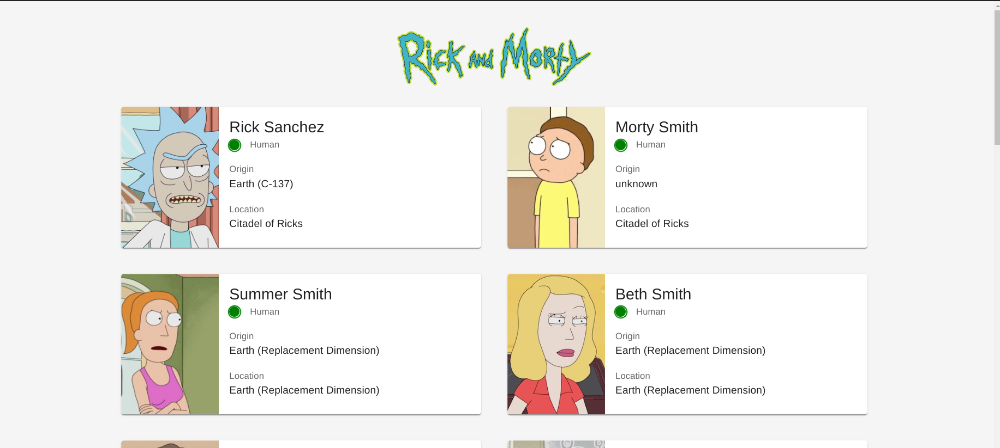

<h1 align='center'>Rick and Morty Characters App ⚡</h1>


#### **App Demo: https://rickandmorty-ll40uhv49-islam2abdelhamid.vercel.app**




## **Using 📦**

1. Clone Template

```
git clone https://github.com/islam2abdelhamid/rickandmorty.git
```

2. Install Packages

```
yarn install
```

3. Start Project

```
yarn dev
```
